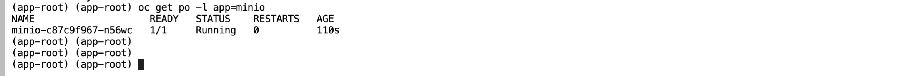
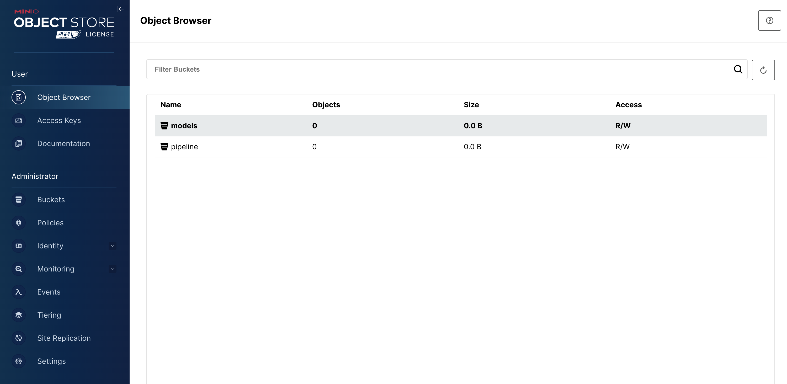
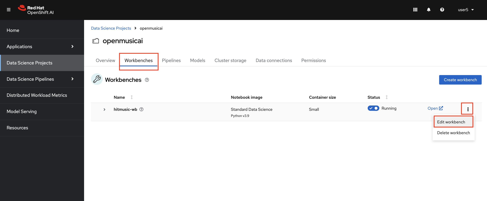

## Object Storage

Object storage provides a flexible and scalable way to store large amounts of unstructured data efficiently, making it a popular choice for cloud storage, content distribution, and for our usecase as well! We will use object storage to store our datasets and model artifacts.

### Setup an Object Storage

> Minio is one of the most popular object storage out there. It is tailored for cloud-native setups so it is fairly quick to spin up an instance for experimentations. It is also compatible with Amazon S3 API, accessible via a RESTful HTTP API, making integration with cloud-native applications and automation pretty straightforward.


1. We will leverage a ready helm chart to deploy Minio. Let's stay in the terminal for this. Check if you can connect to OpenShift. Run the command below.

```
export CLUSTER_DOMAIN="<CLUSTER_DOMAIN>"
oc login --server=https://api.${CLUSTER_DOMAIN##apps.}:6443 -u <USER_NAME> -p <PASSWORD>
```

2. Check if you are in <TEAM_NAME> project.

```bash
oc project
```

3. Use `helm` CLI to install Minio to your environment:

```bash
curl -kL -o helm https://developers.redhat.com/content-gateway/file/pub/openshift-v4/clients/helm/3.14.4/helm-linux-amd64
chmod +x helm
./helm repo add mlops https://rhoai-mlops.github.io/mlops/
./helm install minio mlops/minio
rm helm
```

4. Verify that Minio instance is running:

```bash
oc get po -l app=minio
```



Access Minio via UI and see that there are already two buckets created for you.

```bash
echo https://$(oc get route minio-ui --template='{{ .spec.host }}' -n <TEAM_NAME>)
```

Access to URL and use `minio` as username, `minio123` as password.



`models` bucket is where we will store our buckets, and `pipelines` bucket is needed to store data science pipeline artifacts.

5. If you go back to OpenShift AI UI, you'll also see that two `Data Connections` created for you. The `Data connections` is the part where we provide our Minio configuration and bucket information. You can see the details by clicking the three dots on the right hand side > `Edit data connection`  Data connections also help us to expose the bucket information into our notebooks so that we can use these information without hardcode them into our code.


6. Let's expose `models` bucket info to our workbench. Go back to Workbenches > click three dots on the right > `Edit workbench`



Go down `Data connections`, select `Use a data connection` > `Use existing data connection` and pick `models` from the drop down menu. Hit `Update workbench`


 🪄🪄🪄 Now that we have our storage layer ready, let's dive into our dataset! 🪄🪄🪄