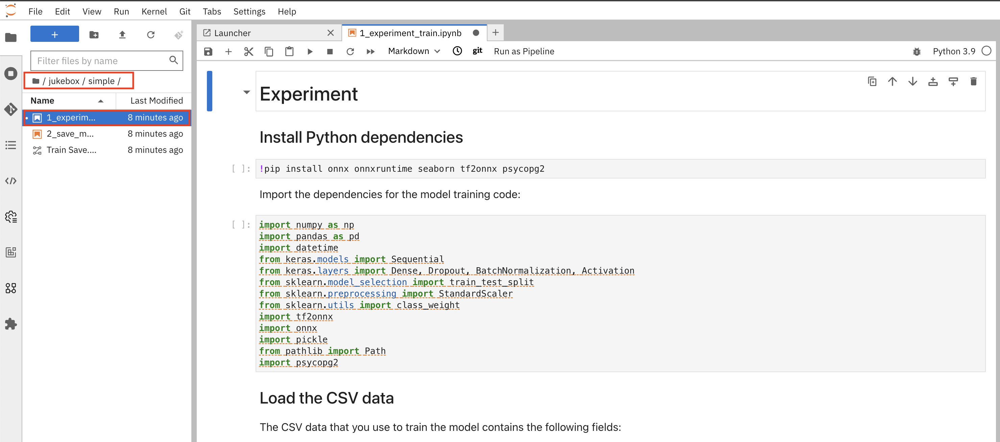
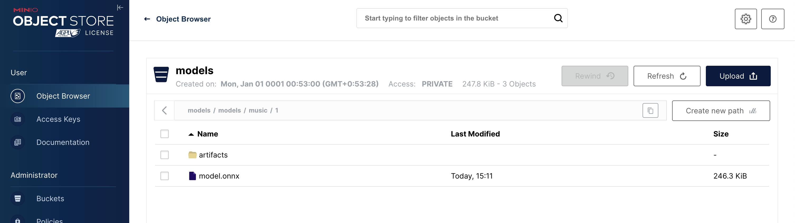
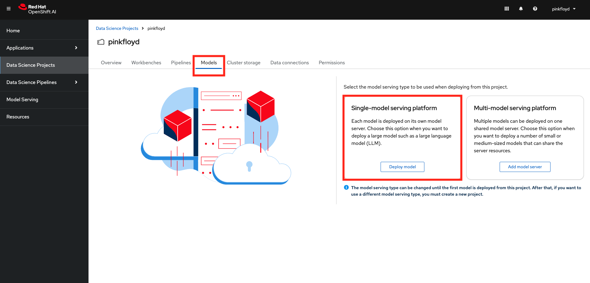
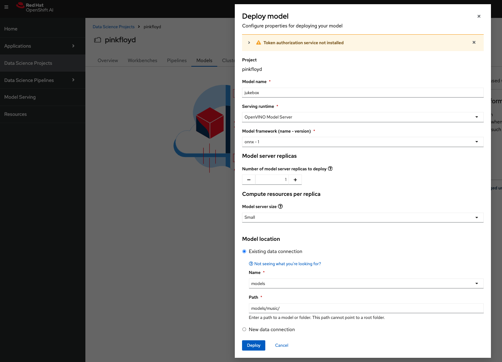
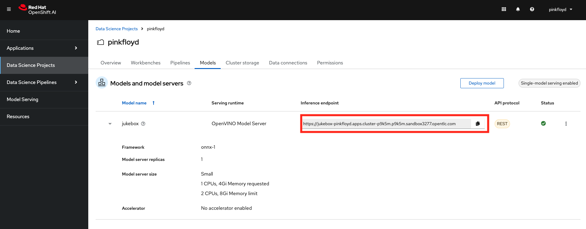

## Inner Data Science Loop

Just like in traditional software development world, here the inner loop represents the iterative process of building, testing, and refining machine learning models.

This inner loop is essential in data science as well because it allows for continuous improvement and optimization of machine learning models. The main stages we usually see in building ML models are as below:

- Data Preparation: Gathering, cleaning, and transforming data into a suitable format for model training.
- Model Development: Selecting and implementing appropriate machine learning algorithms.
- Model Training: Feeding the prepared data into the model and adjusting its parameters to learn patterns and relationships.
- Model Evaluation: Assessing the model's performance using metrics like accuracy, precision, recall, and F1-score.
- Model Refinement: Iterating on the previous steps to improve the model's accuracy and generalization capabilities.

Let's get some experience on these stages by following the steps in notebooks we cloned to our workbench. It all starts with getting familiar with the dataset at hand, so we'll start with `jukebox/1-data_exploration/1-data_exploration.ipynb` notebook.

In a notebook, each box is called `cell`. You need to execute the steps in the Notebook by clicking ▶️ button on the top bar or hitting Shift+Enter when you click on a cell. 

At the end, we have a working model saved in Minio and we can serve it from OpenShift AI. 

Now make your way to the Notebook and when you have a model saved in the `models` bucket, come back here to follow the next steps 😁
Instructions in the Notebook will let you know when to come back here :)

### Model Serving

Now that we have our model artifacts saved in the bucket, we can deploy it in our data science project and serve it from a container. The beauty of OpenShift AI, and the underlying KServe technology, we don't have to worry about the containerization of the model. All we have to do is select the right runtime for our model and point where to model is. Let's give it a try:

1. Go to your data science project > Models > Select Single-Model Serving Platform by clicking Deploy Model.

2. Fill out the form by the following information:

- Model name: `jukebox`
- Serving runtime: `OpenVino Model Server`
- Model framework: `onnx -1`
- Model server replicas: `1`
- Compute resources per replica: `Small`
- Model location: 
    -  Select from existing data connection and pick `models`
    - Path: `models/jukebox`

..and hit `Deploy`

3. It will take some time (cause in the background, OpenShift AI pulls the runtime image, downloads your model from Minio bucket, copies to the right folder and starts the runtime), but eventually you'll get an endpoint that enable you to interract with the model!

4. Copy that URL and go back to your Workbench. Open up the `jukebox/2-dev_datascience/3-request_model.ipynb` notebook and follow the instructions to make some sweet predictions ✨