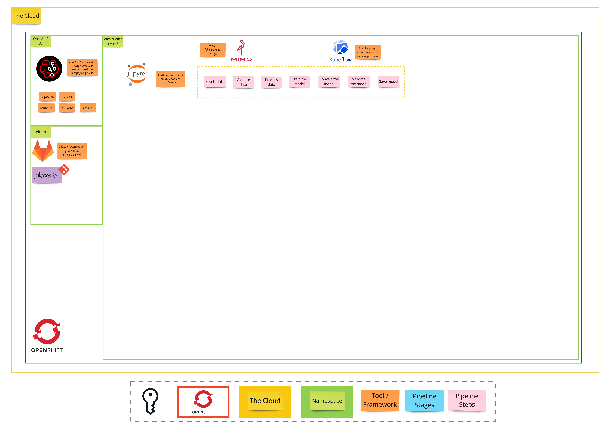

# Exercise 1 - When the Music Starts
> Get familiar with OpenShift AI, set up the development environment

## 👨‍🍳 Exercise Intro

In this exercise, we will walk through a `Data Science Project`, get familiar with the required toolings for experiment we set out to do and create workbench & set up Git repository.

## 🖼️ Big Picture

## 🔮 Learning Outcomes

- Get familiar with OpenShift & OpenShift AI
- Set up the environment to start experimenting

## 🔨 Tools used in this exercise
* OpenShift 4.15+
* OpenShift AI 2.10+
* Jupyter Notebook
* Minio
* Kubeflow Registry