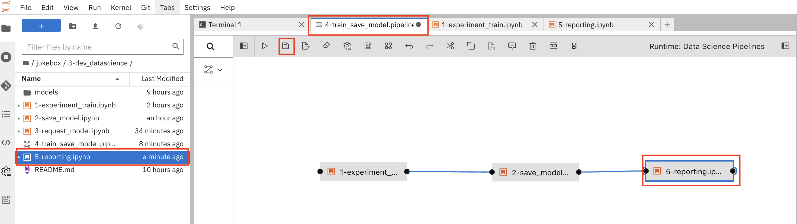

## Elyra

Elyra is an open-source project that enhances Jupyter notebooks by providing a user-friendly interface 💛 It enables data scientists to create complex pipelines visually, integrating data processing, model training, and evaluation into a cohesive environment. Elyra supports rapid prototyping and experimentation, allowing users to leverage existing Jupyter notebooks while simplifying the pipeline development process

We will also leverage the notebooks we used in the previous exercise which makes thing super easy, really!

1. Go back to your Workbench, and open up the file `jukebox/2-dev_datascience/4-train_save_model.pipeline`. Notice that is has the `*.pipeline` extension, this is how Elyra saves the pipeline definition. 

You'll see two notebooks just dragged and dropped from the left pane. First one builds the model and the secon one saves it on S3. The steps we went through before. Let's add a third one to report the result.


2. Right click on an empty space in the left pane, select New Notebook and don't change the Kernel. It creates an `Untitled.ipynb`. Copy the below code block:

    ```python
    print("Pipeline has finished successfully! Yayy!! ✨")
    ```

..and hit Save! (or CTRL+S 😅)


3. If you want to be a good citizen, you can right click to `Untitled.ipynb` and rename it something like `5-reporting.ipynb`

Then select that Notebook and drop it into `4-train_save_model.pipeline` file. Connect the `2-save_model.ipynb` and your new `5-reporting.ipynb`. This will make the reporting run after saving the model. Lastly hit save to store the changes.



4. Let's run the pipeline! Hit `Run Pipeline` and click `OK` It might take some time to initiate the pipeline.


5. When it is triggered succesfully, you'll get the below output. Click `Run Details` to follow the steps and see the pipeline outputs. It will take you to the OpenShift AI's Pipeline view.


6. You'll see everything green when the pipeline runs successfully :)


As you experienced, Elyra is pretty straightforward and easy to set up! It is greatto start with, however when we need more complex pipelines, it's better to transition to a tool like KfP that has more advanced features. 
