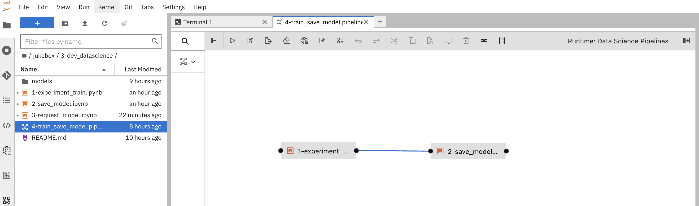
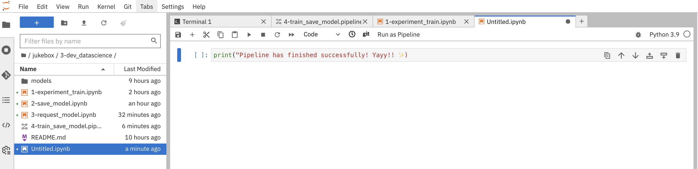
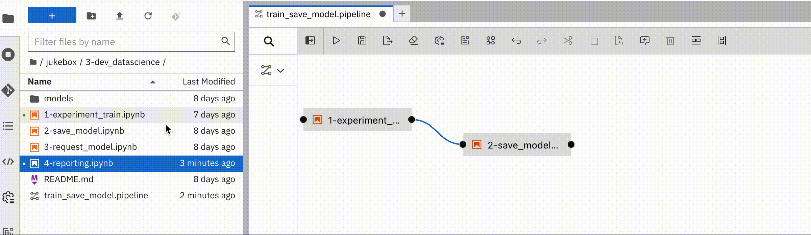
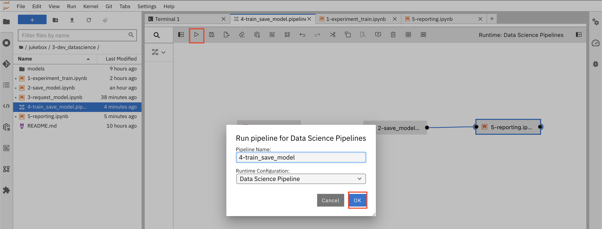
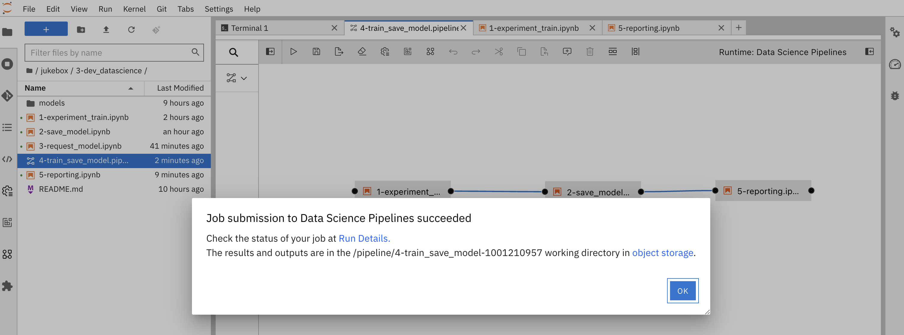
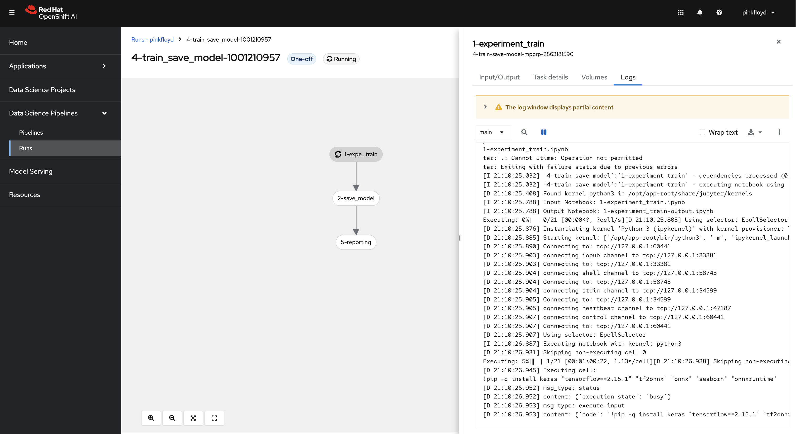

## Elyra

Elyra is an open-source project that enables data scientists to create complex pipelines visually 💛 Elyra supports rapid prototyping and experimentation, allowing users to leverage existing Jupyter notebooks and run them as a pipeline which simplifies the pipeline development process A LOT.

We will also leverage the notebooks we used in the previous exercises to create a pipeline which makes thing super easy, really!

1. Go back to your Workbench, and open up the file `jukebox/2-dev_datascience/4-train_save_model.pipeline`. Notice that is has the `*.pipeline` extension, this is how Elyra saves the pipeline definition. 

You'll see two notebooks connected with a line. First one builds the model and the second one saves it to `models` bucket. The line indicated that the second one only runs if the first one is succesful. These notebooks are the ones we went through int he previous exercise.

 Let's add a third one to report the result.



2. Open up the `3-dev_datascience` folder,  click on an empty space in the left pane (File Browser) and select New Notebook, Keep the Kernel selection as it is and click `Select`. It creates `Untitled.ipynb`. 

3. Copy the below code block:

    ```python
    print("Pipeline has finished successfully! Yayy!! ✨")
    ```

..and hit Save! (or CTRL+S 😅)



3. If you want to be a good citizen, you can right click on `Untitled.ipynb` and rename it something like `4-reporting.ipynb`

Then drag that Notebook and drop it into `4-train_save_model.pipeline` file. Connect the `2-save_model.ipynb` and your new `4-reporting.ipynb`. This will make the reporting run after saving the model. Lastly hit save to store the changes.





4. Let's run the pipeline! Hit `Run Pipeline` and click `OK` It might take some time to initiate the pipeline.



5. When it is triggered succesfully, you'll get the below output. Click `Run Details` to follow the steps and see the pipeline outputs. It will take you to the OpenShift AI's Pipeline view.



6. You'll see everything green when the pipeline runs successfully :)



As you experienced, Elyra is pretty straightforward and easy to set up! It is great to start with, however when we need more complex pipelines, it's better to transition to a tool like KfP that has more advanced features. 
