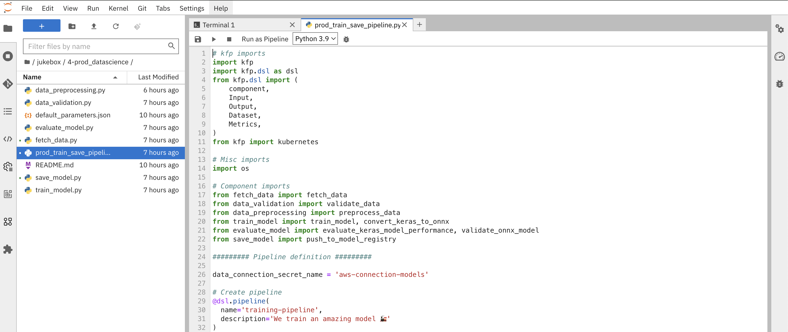
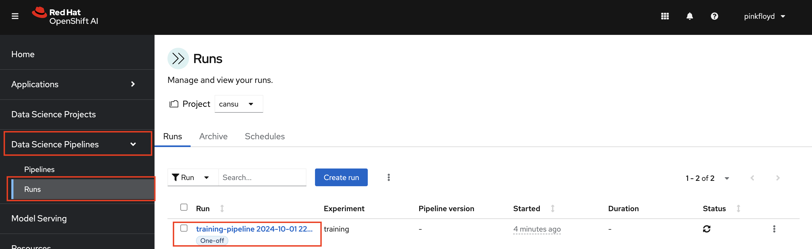
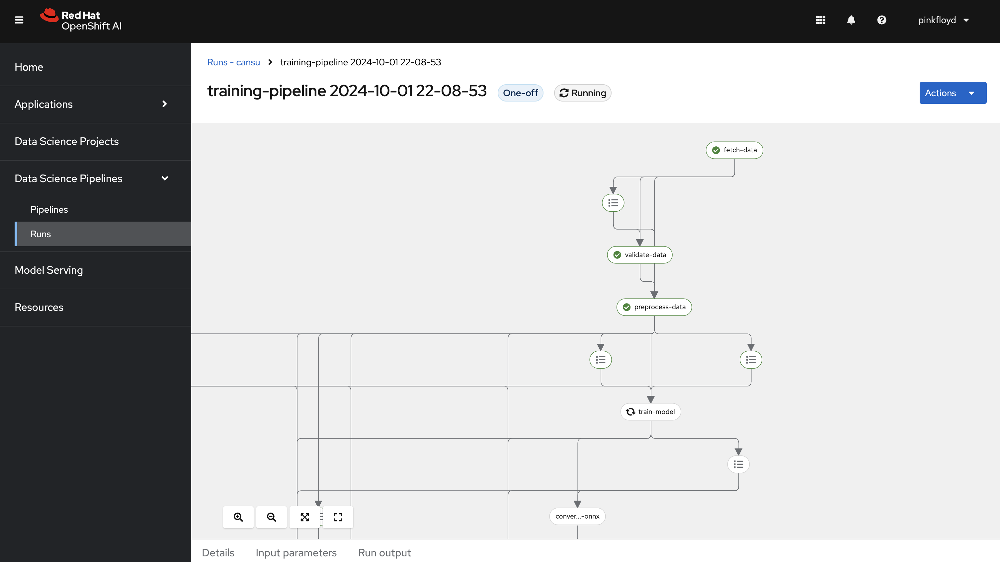

## Kubeflow Pipelines (KfP)

Kubeflow Pipelines (KfP) is a platform designed for building and deploying portable, scalable machine learning pipelines using containers (and no, it's not related to Kung Fu Panda 🐼). KfP provides advanced capabilities such as versioning, metadata tracking, and resource management, which enable teams to monitor and optimize their pipelines efficiently—features that we currently lack in Elyra.

While Elyra was great for quick experimentation, KfP offers the robustness we need for running pipelines continuously. With KfP, we can have better logging, error handling, retry logic, and other production-level features. Essentially, this will become our production-grade training pipeline. And it will be automatically triggered based on source code updates, the arrival of new data, or alerts signaling unusual model behavior.

1. You can find the pipeline definition in the `3-prod_datascience` folder.

    If you explore the files in this folder, you'll notice that they largely mirror the steps we previously executed in our notebooks. However, these steps have been broken down into individual functions and organized into separate files to improve modularity. This makes the pipeline easier to update and maintain over time. This modular approach also allows us to fine-tune specific steps without impacting the entire pipeline, providing more flexibility as we iterate and optimize.

    

2. As we mentioned, we are not supposed to trigger this pipeline manually but just to test the functionality and view the output, let's go to Terminal and start the pipeline by running the below command:

    ```bash
    cd /opt/app-root/src/jukebox/3-prod_datascience
    python prod_train_save_pipeline.py
    ```

    You need to see an output like this:

    <div class="highlight" style="background: #f7f7f7">
    <pre><code class="language-yaml">
        ...
        Experiment details: https://ds-pipeline-dspa.<TEAM_NAME>.svc:8443/#/experiments/details/5bca7df3-1f2d
        Run details: https://ds-pipeline-dspa.<TEAM_NAME>.svc:8443/#/runs/details/422f78a5-81a6-4052-9c8d-9d9d1a89b44a
    </code></pre></div>


3. Go to OpenShift AI UI. Select `Data Science Pipelines` from the left menu and go to `Runs`. You'll see there is one run with the status `Running`. Click to see the details of the pipeline run.

    

    You'll be able to get many details such as;

    - the relationship between the steps
    - the output of each step
    - the artifacts that are generated
    - the metrics and graphs 

    

    Feel free to spend some time in this view to explore more! 

4. Next step is to prepare the environment for MLOps practices 🙌