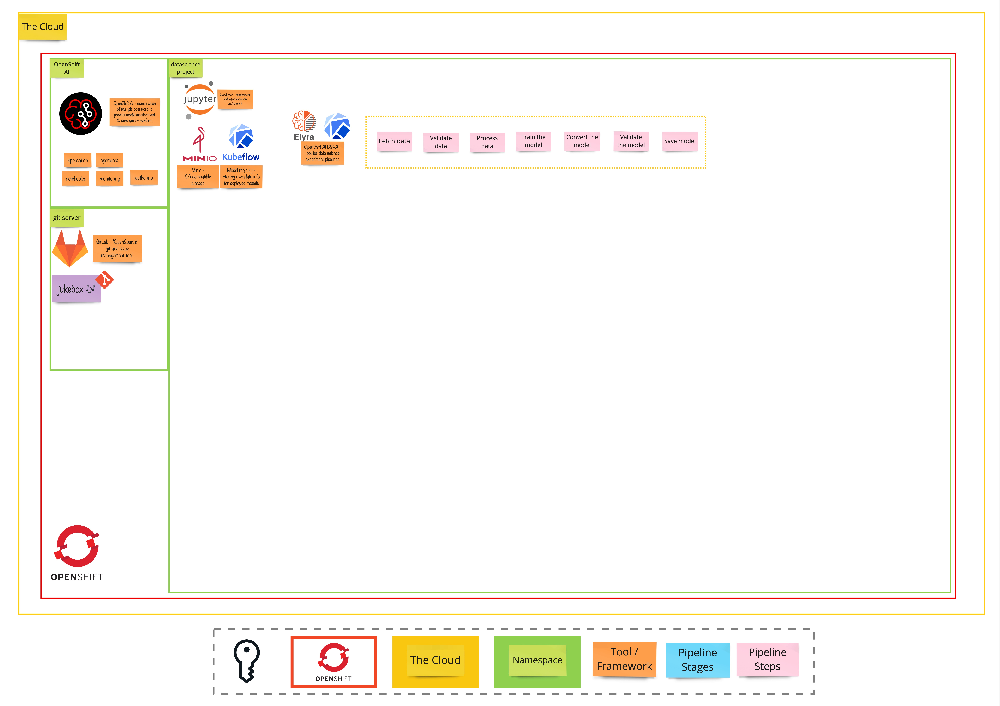

# Exercise 2 - In the Rhythm of Data
> Create pipelines with Elyra and Kubeflow Pipelines (KfP)

## 👨‍🍳 Exercise Intro

In this exercise, we'll be starting with Elyra pipelines to automate the previous steps and then transitioning to Kubeflow Pipelines (KfP) for productionizing the automation.

## 🖼️ Big Picture

## 🔮 Learning Outcomes

- [ ] Create Elyra Pipeline
- [ ] Get familiar with KfP and OpenShift AI Pipelines
- [ ] Execute pipeline from Notebooks

## 🔨 Tools used in this exercise
* Elyra
* KfP Pipelines