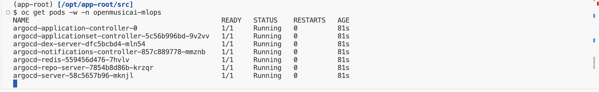
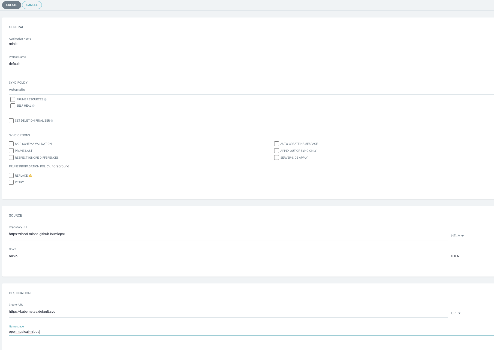
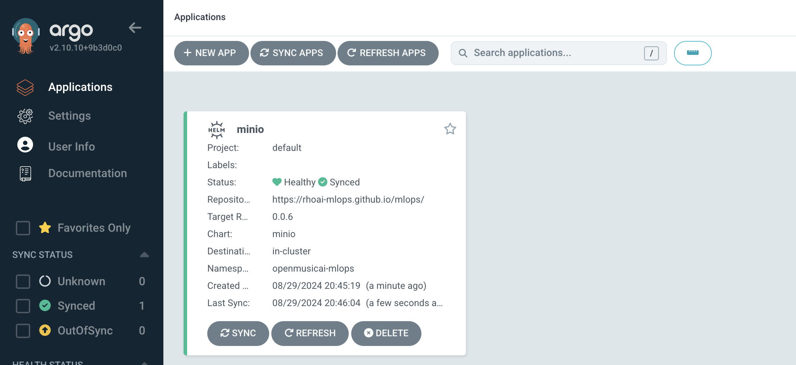
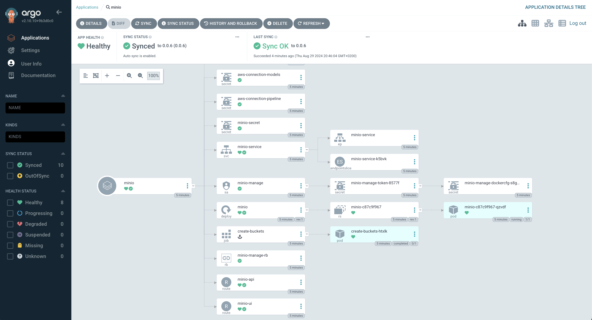

## 🐙 ArgoCD - GitOps Controller 
GitOps can be seen as a developer-centric approach to Ops. It teaches developers good practices around taking ownership of code once it leaves their machines and the approach to deploying and monitoring this code once it’s running.

From Argo CD's website, it is described as a tool that:

<div class="highlight" style="background: #f7f7f7">
<pre>
    automates the deployment of the desired application states in the specified target
    environments. Application deployments can track updates to branches, tags, or be pinned
    to a specific version of manifests at a Git commit.
</pre></div>

When something is seen as not matching the required state in Git, an application becomes out of sync. Depending on how you have implemented your GitOps, Argo CD can then resync the changes to apply whatever is in Git immediately or fire a warning to initiate some other workflow. In the world of Continuous Delivery as implemented by ArgoCD, Git is the single source of truth, so we should always apply the changes as seen there.

### Argo CD Basic Install
> Argo CD is one of the most popular GitOps tools. It keeps the state of our OpenShift applications synchronized with our git repos. It is a controller that reconciles what is stored in our git repo (desired state) against what is live in our cluster (actual state). We can configure Argo CD to take actions based on these differences, such as auto sync the changes from git to the cluster or fire a notification to say things have gone out of whack.

Since we are going to deal with some yaml files, let's switch to a different type of workbench: `code-server` (let's be honest, Jupyter Notebook is not the best when it comes to yaml and commandline utilities🥲)

1. Go to OpenShift AI > `TEAM_NAME` >  Workbenches and click `Create workbench`

  Select a name you want, could be something like `mlops-gitops` 

    For Notebook Image: 

    - Image selection: `ml500-code-server`

    - Deployment size: `Small`

    Leave the rest default and hit `Create`.
  
  When it is in running state, Open it and use your credentials to access it.

2. Open a new terminal by hitting the hamburger menu on top left then select `Terminal` > `New Terminal` from the menu.

   

  We've written a Helm Chart to deploy an instance of Argo CD to the cluster. On your terminal (in the IDE), add the `redhat-cop` helm charts repository. This is a collection of charts curated by consultants in the field from their experience with customers. Pull requests are welcomed :P

    ```bash
    helm repo add redhat-cop https://redhat-cop.github.io/helm-charts
    ```


3. We are using the Red Hat GitOps Operator which was deployed as part of the cluster setup. Normally this step would be done as part of the Operator Install so its a bit more complicated than we would like. Because we did not know your team names ahead of time 👻 we will need to update an environment variable on the Operator Subscription. This tells the Operator its OK to deploy a cluster scoped Argo CD instance into your <TEAM_NAME>-mlops project. On the terminal, login to the cluster with your credentials as below and run the shell script:

    <p class="tip">
    🐌 THIS IS NOT GITOPS - Until we work out a better way to automate this. 🐎 If you see "...." in your terminal after you copy this shell script, do not worry. Hit return and it will run as designed.
    </p>

  ```bash
  export CLUSTER_DOMAIN="<CLUSTER_DOMAIN>"
  oc login --server=https://api.${CLUSTER_DOMAIN##apps.}:6443 -u <USER_NAME> -p <PASSWORD>
  ```

    ```bash
      run()
      {
        NS=$(oc get subscriptions.operators.coreos.com/openshift-gitops-operator -n openshift-gitops-operator \
          -o jsonpath='{.spec.config.env[?(@.name=="ARGOCD_CLUSTER_CONFIG_NAMESPACES")].value}')
        opp=
        if [ -z $NS ]; then
          NS="<TEAM_NAME>-mlops"
          opp=add
        elif [[ "$NS" =~ .*"<TEAM_NAME>-mlops".* ]]; then
          echo "<TEAM_NAME>-mlops already added."
          return
        else
          NS="<TEAM_NAME>-mlops,${NS}"
          opp=replace
        fi

        oc -n openshift-gitops-operator patch subscriptions.operators.coreos.com/openshift-gitops-operator --type=json -p \
        '[{"op":"'$opp'","path":"/spec/config/env/1","value":{"name": "ARGOCD_CLUSTER_CONFIG_NAMESPACES", "value":"'${NS}'"}}]'
        echo "EnvVar set to: $(oc get subscriptions.operators.coreos.com/openshift-gitops-operator -n openshift-gitops-operator \ 
          -o jsonpath='{.spec.config.env[?(@.name=="ARGOCD_CLUSTER_CONFIG_NAMESPACES")].value}')"
      }
      run

    ```

    The output should look something like this with other teams appended as well:
    <div class="highlight" style="background: #f7f7f7">
    <pre><code class="language-bash">
      subscriptions.operators.coreos.com/openshift-gitops-operator patched
      EnvVar set to: <TEAM_NAME>-mlops,anotherteam-mlops
    </code></pre></div>

3. Let’s perform a basic install of Argo CD. Using most of the defaults defined on the chart is sufficient for our use case.

  We’re are also going to configure Argo CD to be allowed pull from our git repository using a secret 🔐.

  Configure our Argo CD instance with a secret in our <TEAM_NAME>-mlops namespace by creating a small bit of yaml 😋:

    ```bash
    cat << EOF > /tmp/argocd-values.yaml
    ignoreHelmHooks: true
    operator: []
    namespaces:
      - <TEAM_NAME>-mlops
    argocd_cr:
      initialRepositories: |
        - url: https://<GIT_SERVER>/<TEAM_NAME>/mlops-gitops.git
          type: git
          passwordSecret:
            key: password
            name: git-auth
          usernameSecret:
            key: username
            name: git-auth
          insecure: true
        - url: https://<GIT_SERVER>/<TEAM_NAME>/mlops-helmcharts.git
          type: git
          passwordSecret:
            key: password
            name: git-auth
          usernameSecret:
            key: username
            name: git-auth
          insecure: true
    EOF
    ```

  Then, let's login to OpenShift, create our mlops namespace and deploy ArgoCD using helm and this piece of yaml:

  ```bash
  oc new-project <TEAM_NAME>-mlops
  ```

  ```bash
  helm upgrade --install argocd \
    --namespace <TEAM_NAME>-mlops \
    -f /tmp/argocd-values.yaml \
    redhat-cop/gitops-operator
  ```

4. If we check in OpenShift we should see the Operator pod coming to life and (eventually) the argocd-server, dex and other pods spin up. To do this, we are going to run a command with a ‘watch’ flag to continuousy monitor pod creation.

  ```bash
  oc get pods -w -n <TEAM_NAME>-mlops
  ```

  

  You must do Control+C to break the ‘watch’ mode to continue to the next step. Once all your pods are running

5. When all the pods are up and running, we can login to the UI of ArgoCD. Get the route and open it in a new browser tab.

  ```bash
  echo https://$(oc get route argocd-server --template='{{ .spec.host }}' -n <TEAM_NAME>-mlops)
  ```

6. Login to Argo CD by clicking `Log in via OpenShift` and use the OpenShift credentials provided.

  

7. Select `Allow selected permissions` for the initial login.

8. You just logged into Argo CD 👏👏👏! Lets deploy a sample application through the UI. In fact, let’s get Argo CD to deploy Minio app you manually deployed previously. On Argo CD - click `CREATE APPLICATION`. You should see see an empty form. Let’s fill it out by setting the following:

   * On the "GENERAL" box
      * Application Name: `mlops-minio`
      * Project: `default`
      * Sync Policy: `Automatic`
   * On the "SOURCE" box
      * Repository URL: `https://rhoai-mlops.github.io/mlops-helmcharts/`
      * Select `Helm` from the right drop down menu
      * Chart: `minio`
      * Version: `0.0.7`
   * On the "DESTINATION" box
      * Cluster URL: `https://kubernetes.default.svc`
      * Namespace: `<TEAM_NAME>-mlops`

    Your form should look like this:

    

9. After you hit create, you’ll see `minio` application is created and should start deploying in your `<TEAM_NAME>-mlops` namespace.

  

10. If you drill down into the application you will get Argo CD’s amazing view of all of the k8s resources that were generated by the chart.

  

11. You can verify Minio is running and behaving as expected by navigating to the url of the app:

  ```bash
  echo https://$(oc get route/minio-ui -n <TEAM_NAME>-mlops --template='{{.spec.host}}')
  ```

🪄🪄 Magic! You’ve now deployed Argo CD and got it to manually deploy an application for you. Next up, we’ll make Argo CD do some more GitOps 🪄🪄


