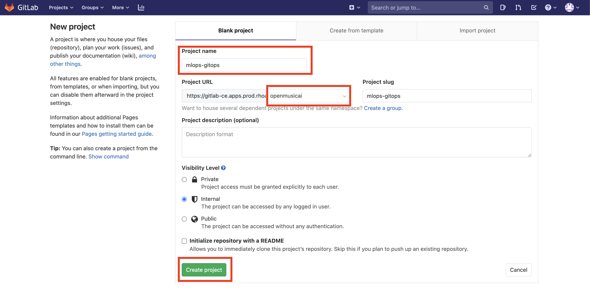
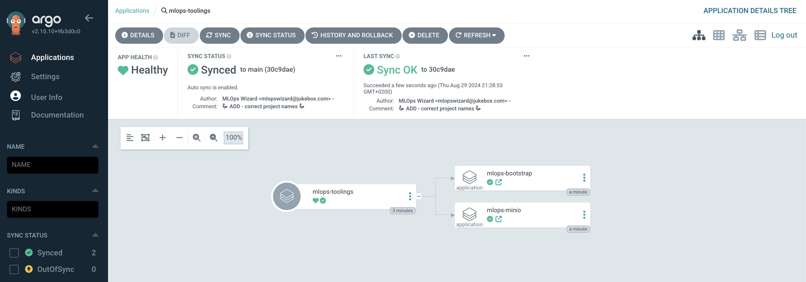

## Application of Applications

# Get GitLab Ready for GitOps

> In this exercise we'll setup our git project to store our code and configuration. We will then connect Argo CD (our gitOps controller) to this git repository to enable the GitOps workflow.

1. Log into GitLab with your credentials. GitLab URL:

    ```bash
    https://<GIT_SERVER>
    ```

    Lets create the git repository that we are going to use for <span style="color:purple;" >GIT</span>Ops purposes. The `mlops-gitops` will serve as a mono-repo holding both our tooling configuration and the model deployment definitions. In the real world, you may want to separate these into different repos! Anyways, hit `New project` button on the right hand side.

    On the new view, use `mlops-gitops` as Project Name, and select **Internal** for Visibility level, then hit Create project. Make sure the project is in the group you created previously and not the username's.

    

2. Let's go back to terminal and clone the original repository and then push it to the newly created GitLab repository.

    ```bash
    git clone https://github.com/rhoai-mlops/mlops-gitops.git
    cd mlops-gitops
    git remote set-url origin https://<GIT_SERVER>/<TEAM_NAME>/mlops-gitops.git
    git push -u origin --all
    ```

   With our git project created and our configuration pushed to it - let's start our GitOps Journey 🧙‍♀️🦄!

    <p class="tip">
    ⛷️ <b>TIP</b> ⛷️ - If your credentials are cached incorrectly, you can try clearing the cache using: <strong>git credential-cache exit</strong>
    </p>

3. This `mlops-gitops` repository is actually just another Helm Chart with a pretty neat pattern built in to create App of Apps in Argo CD. Let's get right into it - in the your IDE, Open the `values.yaml` file in the root of the project. Update it to reference the git repo you just created and your team name. This values file is the default ones for the chart and will be applied to all of the instances of this chart we create. The Chart has Argo CD Application definition as a template, just like the one we manually created in the previous exercise when we deployed Minio in the UI of Argo CD.

    ```yaml
    source: "https://<GIT_SERVER>/<TEAM_NAME>/mlops-gitops.git"
    team: <TEAM_NAME>
    ```

4. The `values.yaml` file refers to the `toolings/values.yaml` which is where we store all the definitions of things we'll need for our countinuous training pipelines. The definitions for things like Minio, Tekton pipeline, Feast etc will all live in here eventually, but let's start small with two objects. One for boostrapping the cluster with some namespaces and permissions. And another one is Minio, so that we actually have the Minio definition in Git. Because as we said, this is GitOps, definitions have to be stored in ✨Git✨. Update your `toolings/values.yaml` by changing your `\<TEAM_NAME\>` in the bootstrap section so it looks like this:

    <div class="highlight" style="background: #f7f7f7">
    <pre><code class="language-yaml">
        applications:
        # Bootstrap Project
        - name: bootstrap
          enabled: true
          source: https://redhat-cop.github.io/helm-charts
          chart_name: bootstrap-project
          source_ref: "1.0.1"
          values:
            serviceaccounts: ""
            # student is the GROUP NAME in IDM
            bindings: &binds
              - name: student
                kind: Group
                role: admin
            namespaces:
              - name: <TEAM_NAME>-mlops
                bindings: *binds
                operatorgroup: true
              - name: <TEAM_NAME>-test
                bindings: *binds
                operatorgroup: true
              - name: <TEAM_NAME>-stage
                bindings: *binds
                operatorgroup: true
    </code></pre></div>


5. This is GITOPS - so in order to affect change, we now need to commit things! Let's get the configuration into git, before telling Argo CD to sync the changes for us.

    ```bash
    cd /opt/app-root/src/mlops-gitops
    git add .
    git commit -m  "🦆 ADD - correct project names 🦆"
    git push
    ```

  <p class="warn">
    ⛷️ <b>NOTE</b> ⛷️ - Bootstrap step also provides the necessary rolebindings. That means now the other users in the same team can access <b><TEAM_NAME></b> environments.
  </p>


6. In order for Argo CD to sync the changes from our git repository, we need to provide access to it. We'll deploy a secret to cluster, for now *not done as code* but in the next lab we'll add the secret as code and store it encrypted in Git. In your terminal

    Add the Secret to the cluster:

    ```bash
    cat <<EOF | oc apply -n <TEAM_NAME>-mlops -f -
      apiVersion: v1
      data:
        password: "$(echo -n <GITLAB_PASSWORD> | base64 -w0)"
        username: "$(echo -n <GITLAB_USER>| base64 -w0)"
      kind: Secret
      type: kubernetes.io/basic-auth
      metadata:
        annotations:
          tekton.dev/git-0: https://<GIT_SERVER>
          sealedsecrets.bitnami.com/managed: "true"
        name: git-auth
    EOF
    ```

7. Install the tooling (only bootstrap, and Minio at this stage..). Once the command is run, open the ArgoCD UI to show the resources being created. We’ve just deployed our first AppOfApps!

    ```bash
    cd /opt/app-root/src/mlops-gitops
    helm upgrade --install argoapps --namespace <TEAM_NAME>-mlops .
    ```

    

8. As Argo CD sync's the resources we can see them in the cluster:

    ```bash
    oc get projects | grep <TEAM_NAME>
    ```

    ```bash
    oc get pods -n <TEAM_NAME>-mlops
    ```

🪄🪄 Magic! You've now deployed an app of apps to scaffold our tooling and projects in a repeatable and auditable way (via git!). Next up, we'll prepare our model deployment definitions. 🪄🪄
