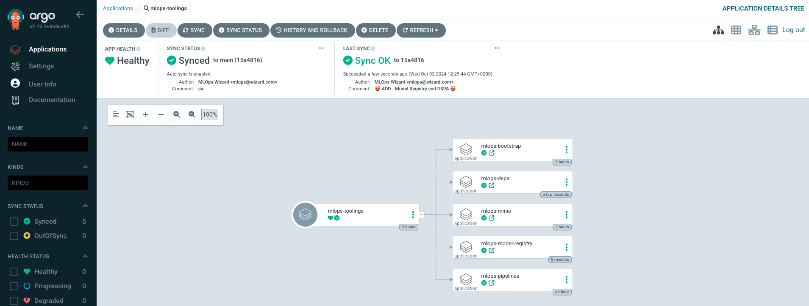

# Extend Application of Applications

We need to add two more application to our MLOps toolings in order to run our automation successfully; KubeFlow Registry & Data Science Pipelines Application.

These two were already installed in your dev environment. Now we need to bring them in with GitOps.

1. Add the below yaml to `mlops-gitops/toolings/values.yaml` for KubeFlow Registry.

    ```yaml
      # KubeFlow Model Registry
      - name: model-registry
        enabled: true
        source: https://github.com/kubeflow/model-registry/
        source_path: manifests/kustomize/overlays/db
        source_ref: v0.2.7-alpha
        no_helm: true
    ```

2. And deploy Data Science Pipeline Application by copying the yaml to `mlops-gitops/toolings/values.yaml`

    ```yaml
      # Data Science Pipeline Application
      - name: minio
        enabled: true
        source: https://rhoai-mlops.github.io/mlops-helmcharts/
        chart_name: dspa
        source_ref: "0.0.1"
    ```

3. And now, let's push the changes to our GitOps repository.
    ```bash
    cd /opt/app-root/src/mlops-gitops
    git add .
    git commit -m  "😻 ADD - Model Registry and DSPA 😻"
    git push
    ```

4. Check Argo CD to see the deployed applications :)

